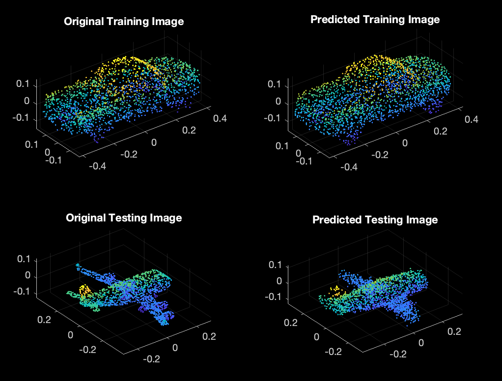
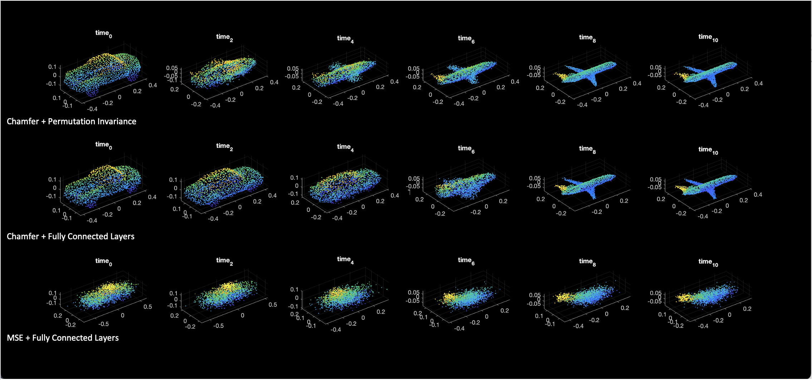
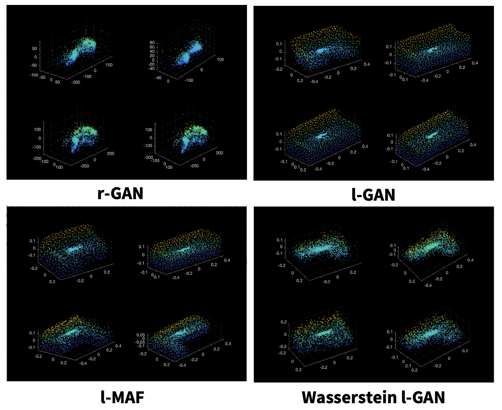

# Overview
Recently, 3D point clouds have become the preferred method for several geometric modeling and computer vision problems. They provide an accurate yet sparse sampling of the physical world and provide easy integration to traditional image processing pipelines. They have also been rigorously explored in the deep learning community.

To this end, in our CS 231N project we try to understand the latent space that point clouds live in and in our CS 236 project we aim to generate new point clouds from this learned latent space. For more detail please refer to the full reports below.

[CS 231N Final Report](pdf_folder/CS231N_FinalReport.pdf)
[CS 236 Final Report](pdf_folder/CS236_Project_Final_Report.pdf)

By: Sidhika Balachander, Samaksh Goyal in 2021.

<!-- # Layout

AE_models folder -- folder with different AE models

**create_splits.py :**
- split data into train, val, and test
- inputs: 
	- file with list of human readable objects to include in data, name
- outputs: 
	- splits/name/file of list of paths to training examples
	- splits/name/file of list of paths to val examples
	- splits/name/file of list of paths to test examples

**train_model.py:**
- trains AE model
- inputs: 
	- path to file with train paths
	- path to file with val paths
	- name
- outputs: 
	- saved_models/name/models saved every 100 epochs
	- saved_models/name/models saved after best epoch
                              
**test_model.py** 
- tests AE model
- inputs: 
	- path to file with test paths
	- name
- outputs: 
	- predicted/name/ply files for test examples
               
**interpolate_layer.py** 
- interpolation
- inputs: 
	- path to folder with decoded training examples
	- path to folder with decoded testing examples
	- model
	- output_prefix
-  outputs: 
	- interpolation/output_prefix/train_train folder for interpolated decoded output
	- interpolation/output_prefix/train_test folder for interpolated decoded output
	- interpolation/output_prefix/test_test folder for interpolated decoded output
               
**PointCloudDataset.py** 
- input to dataloader
- inputs: 
- outputs: 


# Progress:
# Starting from scratch, building autoencoder
 -->

# Visual Results

## Auto Encoder Validation

When we visualized the results for a car point cloud that was present in the train set, we are able to almost fully recover the original shape. Most interestingly we conserve small domain specific details like the curvature of the wheels of the car, however we lose the the rigid structure of the truck bed which now has a softer profile. As a test we try to visualize an airplane and the model is able to get a reasonable approximation that matches the general frame and span of the wings. However during testing we lose many details like the nose angle and the 4 engines beneath the wings. We can see that the autoencoder is struggling with this since it produces a heavier set of point clouds where the engines should be, however it does not recover their cylindrical shape.



## Latent Space Analysis

To better compare the latent space learned by our three models we interpolate the latent representation of a car and an airplane.

The baseline model consisting of fully connected layers and MSE loss is on the bottom row. Because the encodings of the two interpolants are extremely inaccurate, so are their intermediate interpolations.

Our second model in which we retain our fully connected layers but add in Chamfer loss, is on the middle row. The encoding is of greater visual quality for both interpolants. We see that using a permutation invariant loss function has considerable advantages. Since Chamfer distance is attempting to minimize the misalignment of each point from the other point, there is a serious penalty if even one of the x,y,z coordinates aren't close to the target. 

Our last model, for which we replace the fully connected layers with a permutation invariant layer, is shown in the top row. Time steps 2 and 4 represents a more hybrid shape of the mixture of a car and a plane. This seems to suggest that the latent space learned by adding permutation invariance is more continuous. Furthermore step 2 is quite intriguing because it shows the formation of wing like structures on the car while also preserving the the hood and trunk of a pickup truck. Thus showing a smoother transfer of information than compared to the previous model.

Lastly, recall the goal of interpolating in the latent space: to measure the degree to which our compressed latent dimension is able to capture the geometric topology of the space represented by the car-plane shapes. Based on figure it seems that compressability was largely improved by using Chamfer distance, while the smoothness of the geometric topology was improved by permutation invariance.



## Generated Sofa Samples

We now evaluate the visual quality of the generated samples by passing 4 random seeds from a multivariate normal distribution. As the figure shows $r$-GAN remains unable to sample point clouds that resemble any form of a sofa, suggesting that a point cloud is too rich of a representation to learn from. $l$-GAN and $l$-MAF adequately samples sofas, which indicates using AE latent representations as proxy for the richer point cloud data is effective. Wasserstein $l$-GAN results in fuzzy sofas, could be due to the strength of $\lambda$ and norm selection.

Note that interestingly the sofas generated are topologically varying. We see that L-shaped couches and once with different back, shoulder support and different arm rest configurations. This indicates that the model is able to sample from a spectrum of couches, yet the ability to model the full distribution of couches must be shown quantitatively.

The concentrated blue patch in center possibly corresponds to generator always learning to scatter points on the middle seat of a sofa (as all sofas are within unit sphere).



# Quick Start

**Get data:**

`./download_data.sh`

**Create test, val, train splits:**
```
python create_splits.py -c guitar bus \
			-n guitar_bus
```
- Creates folder 
	- splits/guitar_bus
- Creates files 
	- splits/guitar_bus/train.txt
	- splits/guitar_bus/val.txt
	- splits/guitar_bus/test.txt

**Train model:**
```
python train_model.py -t splits/guitar_bus/train.txt \
		      -v splits/guitar_bus/val.txt \
		      -n train_guitar_bus
```
- Creates folder 
	- saved_models/train_guitar_bus
- Creates files 
	- saved_models/train_guitar_bus/losses.txt
	- saved_models/train_guitar_bus/\*.pt
	- saved_models/train_guitar_bus/best_\*.pt 

**Test model:**
```
python test_model.py -t splits/guitar_bus/test.txt \
		     -m saved_models/train_guitar_bus/best_5.pt \
		     -n test_guitar_bus
```
- Creates folder 
	- saved_models/predicted
- Creates files 
	- saved_models/predicted/\*.ply


**Test model:**
```
python interpolate_layer.py -pc1 shape_net_core_uniform_samples_2048/03467517/3d65570b55933c86ec7e7dbd8120b3cb.ply \
			    -pc2 shape_net_core_uniform_samples_2048/03467517/10b65379796e96091c86d29189611a06.ply \
			    -m saved_models/train_guitar_bus/best_5.pt \
			    -n interpolate_guitar_bus
```
- Creates folders 
	- interpolation/output_prefix/train_train
	- interpolation/output_prefix/train_test
	- interpolation/output_prefix/test_test
- Creates files
	- interpolation/output_prefix/\*/time_\*.ply
